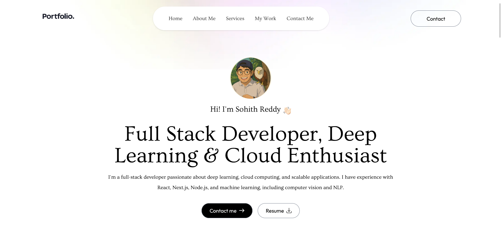
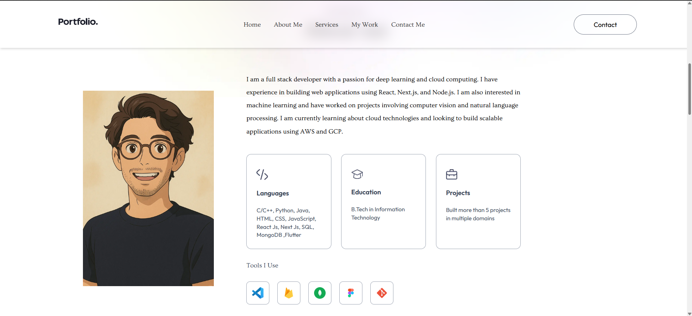
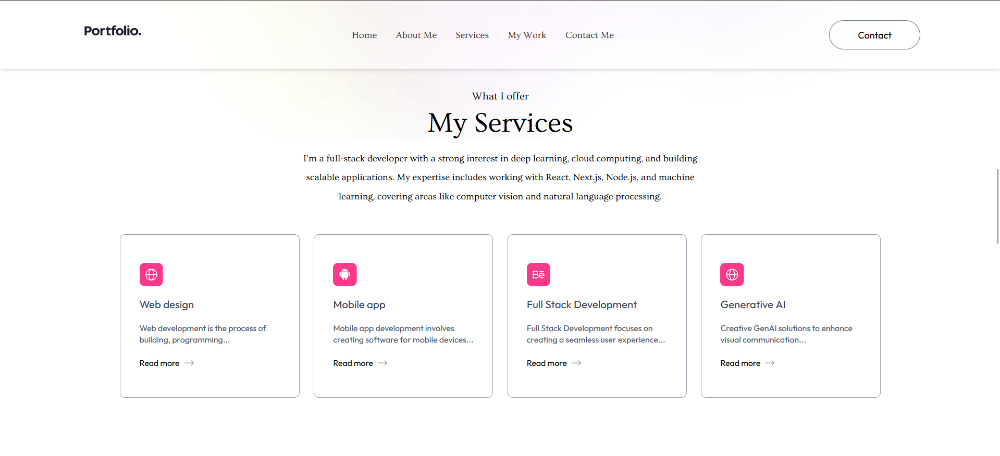

<div align="center">

# ✨ Sohith Reddy's Portfolio

[](https://your-portfolio-url.vercel.app)
[](https://nextjs.org)
[](https://github.com/Sohith-reddy/portfolio/stargazers)

[View Demo](https://sohith-portfolio-sohith-reddys-projects.vercel.app) • [Report Bug](https://github.com/Sohith-reddy/portfolio/issues) • [Request Feature](https://github.com/Sohith-reddy/portfolio/issues)

<!--  -->

</div>

## 🎨 Portfolio Showcase

<div align="center">

### 🏠 Modern Landing Page

  
  
### 💼 Interactive Projects Gallery

  
  
### 📱 Responsive Design

  

</div>

## ⚡ Deployment Status

| Environment | Status | URL |
|-------------|--------|-----|
| Production | [](https://sohith-portfolio-sohith-reddys-projects.vercel.app/) | [View](https://sohith-portfolio-sohith-reddys-projects.vercel.app/) |


## 🚀 Tech Stack & Features

| Category | Technologies & Features |
|:---------|:----------------------|
| 🎯 **Frontend** | • Next.js 14<br/>• Tailwind CSS<br/>• Framer Motion |
| 🛠️ **Backend** | • Node.js<br/>• RESTful APIs<br/>• Web3Forms Integration |
| ☁️ **Deployment** | • Vercel Platform<br/>• CI/CD Pipeline<br/>• Environment Management |
| 📱 **Responsive** | • TailWind Css<br/>• Customized CSS<br/>

## 🎯 Key Features

| Category | Features |
|----------|----------|
| 📱 **UI/UX** | Responsive Design, Dark Mode, Smooth Animations |
| ⚡ **Performance** | 90+ Performance Score, Optimized Assets |
| 🛡️ **Security** | Headers Protection, Form Validation |
| 🔍 **SEO** | Meta Tags, Sitemap, robots.txt |

## 🚀 One-Click Deploy

Deploy your own version of this portfolio using Vercel:

[](https://vercel.com/new/clone?repository-url=https://github.com/Sohith-reddy/portfolio)

## 💻 Local Development

```bash
# Clone the repository
git clone https://github.com/Sohith-reddy/portfolio.git

# Install dependencies
cd portfolio
npm install

# Create .env.local file
copy .env.example .env.local

# Start development server
npm run dev
```

## 📊 Performance Metrics

| Metric | Score |
|--------|-------|
| Performance |  |
| Accessibility |  |
| Best Practices |  |
| SEO |  |

## 🔗 Environment Variables

Create a `.env.local` file with:

```env
NEXT_PUBLIC_WEB3FORMS_KEY=your_api_key
NEXT_PUBLIC_VERCEL_URL=your_vercel_url
```

## 📬 API Integration

### Contact Form API

```typescript
interface ContactPayload {
  access_key: string;
  name: string;
  email: string;
  message: string;
}

const response = await fetch('https://api.web3forms.com/submit', {
  method: 'POST',
  headers: {
    'Content-Type': 'application/json',
  },
  body: JSON.stringify(payload),
});
```

## 🌐 Deployment URLs

| Environment | URL |
|-------------|-----|
| Production | `https://sohith-portfolio-sohith-reddys-projects.vercel.app` |


<div align="center">

## 🤝 Connect & Support

[](https://linkedin.com/in/sohithreddy)
[](https://twitter.com/Sohith_01)
[](https://sohith-portfolio-sohith-reddys-projects.vercel.app)
[](https://leetcode.com/u/sohith_reddy01/)


---

<br/> 

**Made with ❤️ by Sohith Reddy**

</div>
